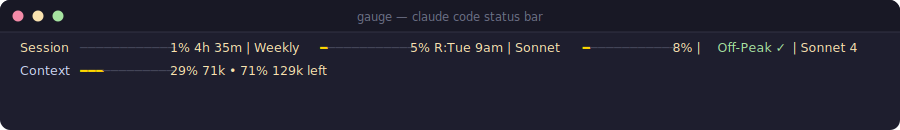

# gauge

A live status bar for Claude Code. Know your session, weekly budget, and context window at a glance — without opening a browser tab or guessing.



```
Session ──────────── 8% 4h 52m | Weekly ━─────────── 5% R:Tue 9am | Sonnet ━─────────── 8% | Off-Peak ✓
Context ━━━───────── 29% 58k • 71% 142k left
```

Line 1 tracks session burn, weekly rolling window, and Sonnet model usage — with reset times and a peak-hours indicator. Line 2 shows how deep into the context window the current conversation is.

## Install

```bash
git clone https://github.com/a692570/gauge ~/.gauge
python3 ~/.gauge/claude_status.py --install
python3 ~/.gauge/claude_status.py --context-format full
```

Restart Claude Code. The bar shows up automatically on every interaction.

Requires Python 3.12+. On macOS: `brew install python@3.13`

## Configure

```bash
# Themes (default, ocean, sunset, ember, frost, candy, neon, pride, mono, rainbow)
python3 ~/.gauge/claude_status.py --theme ember

# Bar style
python3 ~/.gauge/claude_status.py --bar-style dot

# Peak hours window (the 2x token consumption period)
python3 ~/.gauge/claude_status.py --peak-hours 13:00-19:00

# Hide sections you don't need
python3 ~/.gauge/claude_status.py --hide cost
python3 ~/.gauge/claude_status.py --hide lines
```

## Why it exists

Claude Code's session and weekly limits reset quietly. Running hard into a wall mid-conversation — then waiting for a reset — breaks flow. Gauge surfaces the numbers so you can pace yourself without thinking about it.

The context bar is the other half. Long sessions drift toward the limit without any warning. Seeing `29% 58k • 71% 142k left` is a lot more actionable than noticing the model getting weird.

## License

MIT
